# Industrial Interaction Clip Mining Pipeline

Production-grade offline video processing pipeline for extracting 10-second clips containing person-machine interactions from long industrial CCTV footage (6–10 hours).

---

## Big Picture Flow

```mermaid
flowchart TD
    A["📹 Raw Video File (.mp4)"] --> B["VideoLoader\n(cv2.VideoCapture)"]
    B --> C["frame: np.ndarray\nshape=(H,W,3) BGR\nframe_idx: int\ntimestamp: float"]
    C --> D["YOLODetector\n(YOLOv8x @ 1280px)"]
    D --> E["person_dets: List[Dict]\nmachine_dets: List[Dict]"]
    E --> F["ByteTracker ×2\n(one per class)"]
    F --> G["person_dets_tracked: List[Dict]\n+track_id field"]
    G --> H["ViTPoseEstimator"]
    C --> H
    H --> I["poses: List[np.ndarray]\nshape=(N_persons, 17, 3)"]
    C --> J["MiDaSDepth\n(DPT_Large)"]
    J --> K["depth_map: np.ndarray\nshape=(H,W) float32"]
    G --> L["InteractionScorer"]
    E --> L
    I --> L
    K --> L
    L --> M["interaction_score: float 0–1\ninteraction_details: List[Dict]"]
    M --> N["ClipMiner"]
    N --> O["candidate_clips: List[Dict]\n(temporal buffer)"]
    O --> P["NMS filter"]
    P --> Q["🎬 clip_XXXX.mp4\n🗒️ clip_XXXX.json\n📊 summary.json"]
```


---

## Features

- **High-Resolution Detection**: YOLOv8 with 1280px inference for small object detection
- **Robust Tracking**: ByteTrack for multi-object tracking with ID persistence
- **Pose Estimation**: ViTPose for human pose and activity detection
- **Depth Estimation**: MiDaS for monocular depth and perspective handling
- **Multi-Modal Interaction Scoring**: Combines proximity, pose, motion, and HOI signals
- **Temporal Aggregation**: Sliding window analysis with NMS for clip extraction
- **GPU Accelerated**: Automatic GPU detection with CPU fallback

## System Requirements

- Python 3.8+
- CUDA-capable GPU (recommended, RTX A6000 or better)
- 16GB+ RAM
- 50GB+ disk space (for models and outputs)

---

## Installation

### 1. Create Virtual Environment

```bash
cd industrial_interaction_pipeline
python3 -m venv venv
source venv/bin/activate        # Linux/Mac
# or
venv\Scripts\activate           # Windows
```

### 2. Install Dependencies

```bash
pip install --upgrade pip
pip install -r requirements.txt
```

### 3. Download Models

Models are downloaded automatically on first run:
- YOLOv8x (`yolov8x.pt`) — ~130 MB
- MiDaS `DPT_Large` — ~1.4 GB

---

## Running the Pipeline

> **Important**: Always activate the virtual environment before running.

```bash
source venv/bin/activate
```

### Basic Run (default config, default output folder)

```bash
venv/bin/python main.py --input /path/to/your_video.mp4
```

### Specify an Output Folder

```bash
venv/bin/python main.py \
    --input /path/to/your_video.mp4 \
    --output output_3
```

### Use a Custom Config File

```bash
venv/bin/python main.py \
    --config configs/rers2_config.yaml \
    --input /path/to/your_video.mp4 \
    --output output_3
```

### Limit Frames for Quick Testing

```bash
venv/bin/python main.py \
    --input /path/to/your_video.mp4 \
    --output output_test \
    --max_frames 500
```

### All CLI Arguments

| Argument | Required | Default | Description |
|---|---|---|---|
| `--input` | ✅ Yes | — | Path to input video file (`.mp4`, `.avi`, etc.) |
| `--output` | No | From config | Output folder for clips and metadata |
| `--config` | No | `configs/default_config.yaml` | Path to YAML config file |
| `--max_frames` | No | `null` (entire video) | Stop after N frames (useful for testing) |

### Real-World Example (used for RERS 2 video)

```bash
venv/bin/python main.py \
    --config configs/rers2_config.yaml \
    --input "RERS 2_RERS-2_main_20251212154926.mp4" \
    --output output_3
```

> **Tip**: If your video filename contains spaces, wrap it in quotes.

---

## Output

For each run, the output folder contains:

```
output_3/
├── clip_0001.mp4       # Annotated 10-second clip
├── clip_0001.json      # Metadata for clip_0001
├── clip_0002.mp4
├── clip_0002.json
└── summary.json        # Full run summary (video info + all clips + config used)
```

**Clip JSON example:**
```json
{
  "clip_id": "clip_0001",
  "start_time": 112.5,
  "end_time": 122.5,
  "duration": 10.0,
  "interaction_score": 0.87,
  "high_score_frames": 95
}
```

---

## Configs

Two ready-to-use configs are provided in `configs/`:

| File | Best For |
|---|---|
| `default_config.yaml` | Strict filtering — high-confidence interactions only |
| `rers2_config.yaml` | Relaxed filtering — suitable for most industrial videos |

For a full explanation of every config parameter, see **[configs/CONFIG_GUIDE.md](configs/CONFIG_GUIDE.md)**.

---

## Pipeline Architecture

```
Input Video
    ↓
[Video Loader] → Frame extraction
    ↓
[YOLOv8 Detector] → Person & machine detection
    ↓
[ByteTrack] → Multi-object tracking
    ↓
[ViTPose] → Pose estimation
    ↓
[MiDaS] → Depth estimation
    ↓
[Interaction Scorer] → Multi-modal scoring
    ↓
[Clip Miner] → Temporal aggregation & extraction
    ↓
Output Clips (MP4 + JSON metadata)
```

---

## Performance

### Processing Speed (RTX A6000)

- **1080p video**: ~7–10 FPS
- **6-hour video**: ~3–6 hours processing time
- **GPU memory**: ~8 GB | **RAM**: ~4 GB

### Optimization Tips

1. **Reduce image size**: `img_size: 960` for faster processing
2. **Frame skipping**: `frame_skip: 2` to process every 2nd frame
3. **Limit frames**: `--max_frames 1000` for quick testing
4. **Smaller models**: `yolov8m.pt` instead of `yolov8x.pt`

---

## Troubleshooting

### GPU Not Detected
```bash
venv/bin/python -c "import torch; print(torch.cuda.is_available())"
```

### Out of Memory
- Reduce `img_size` in config
- Reduce `batch_size` for detection/pose
- Use smaller models (`yolov8m`, `DPT_Hybrid`)

### No Clips Extracted
- Lower `interaction_threshold` (try `0.4`)
- Reduce `min_interaction_frames` (try `40`)
- Use `rers2_config.yaml` instead of `default_config.yaml`
- Check `pipeline.log` for detection issues

### Clips Overlapping
- Lower `nms_threshold` (try `0.1`) to enforce stricter deduplication

---

## Module Details

| Module | Folder | Description |
|---|---|---|
| Detection | `detector/` | YOLOv8 person & machine detection |
| Tracking | `tracker/` | ByteTrack multi-object tracking |
| Pose | `pose/` | ViTPose 17-keypoint estimation |
| Depth | `depth/` | MiDaS monocular depth |
| Interaction | `interaction/` | Multi-modal scoring (proximity + pose + motion) |
| Clip Mining | `clip_miner/` | Sliding window + NMS clip extraction |

---

## Citation

- **YOLOv8**: [Ultralytics](https://github.com/ultralytics/ultralytics)
- **ByteTrack**: [Zhang et al.](https://github.com/ifzhang/ByteTrack)
- **ViTPose**: [Xu et al.](https://github.com/ViTAE-Transformer/ViTPose)
- **MiDaS**: [Ranftl et al.](https://github.com/isl-org/MiDaS)

## License

This project is for research and educational purposes.

## Support

Enable debug logging for detailed output:

```yaml
# In your config file:
logging:
  level: "DEBUG"
```

Then check `pipeline.log` in the project root.
